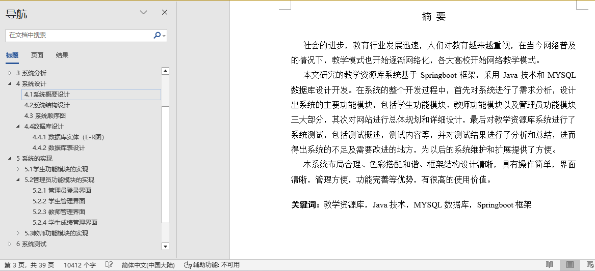
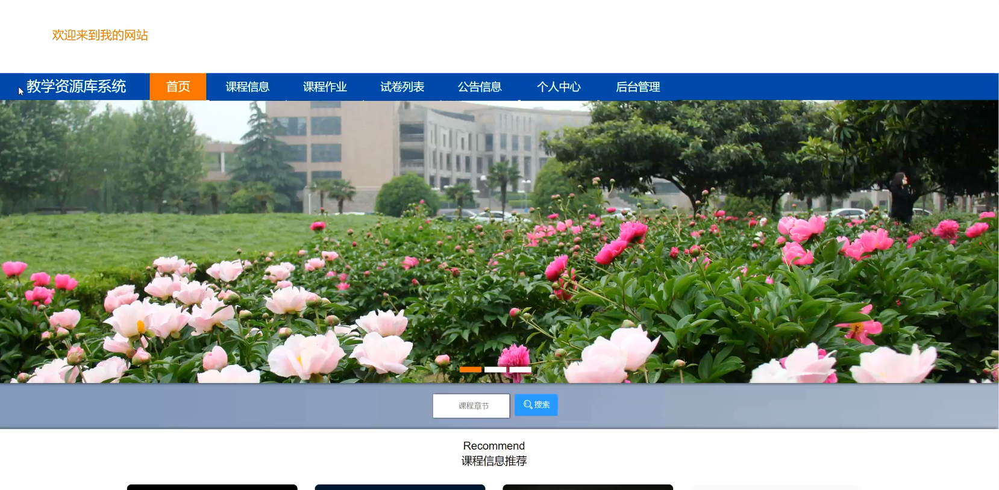
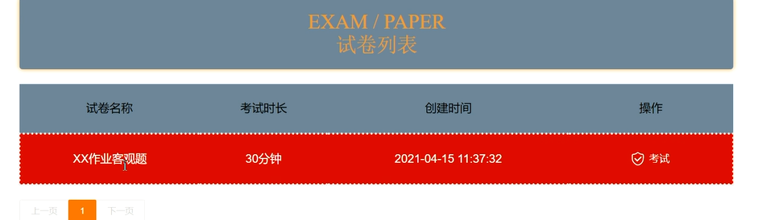
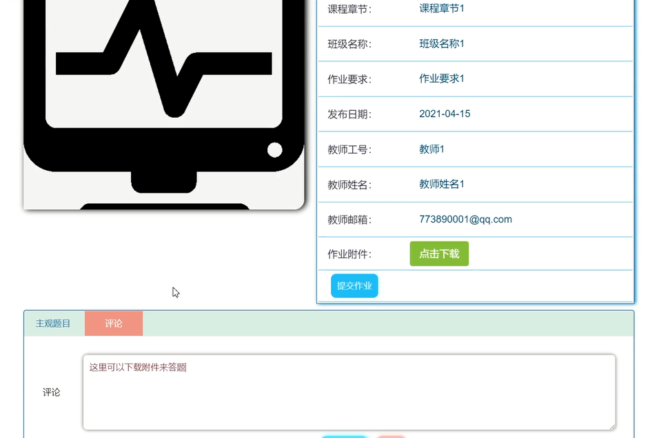
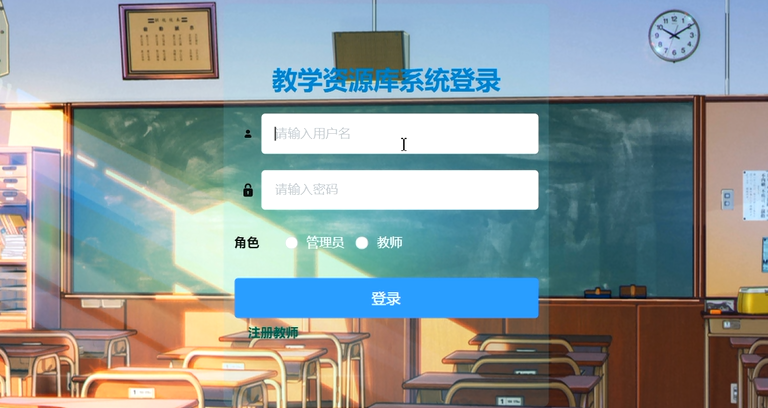
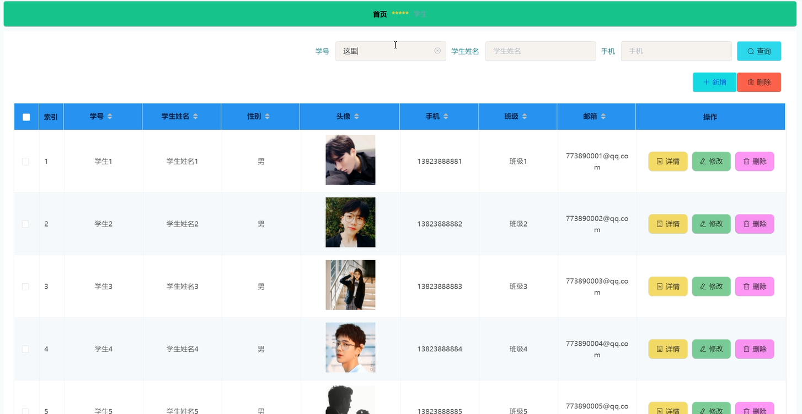
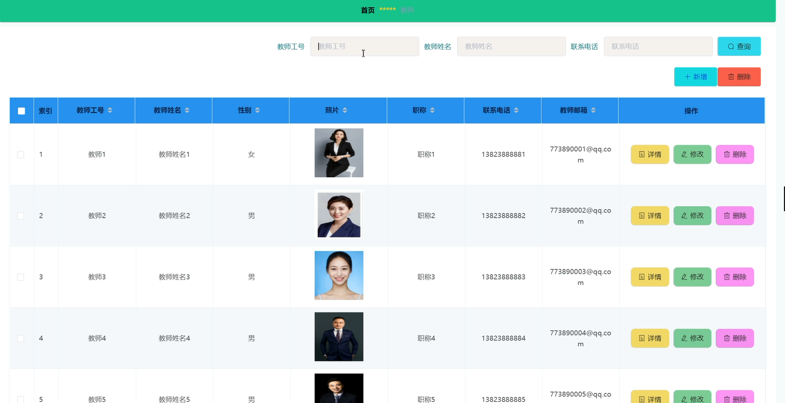
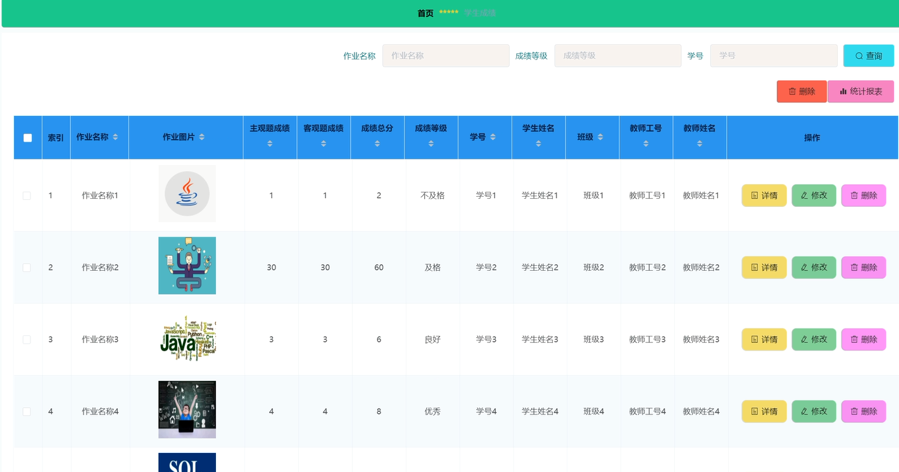
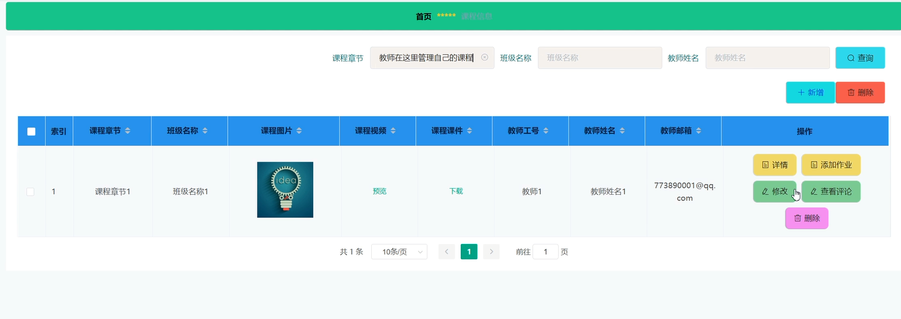

## 基于vue的教学资源库教学资源库(程序+报告)

###  获取sql数据库文件: 从戎源码网 (https://armycodes.com/) QQ: 386869957 QQ群: 377586148
###  所有系统地址: (https://github.com/YuLin-Coder/AllProjectCatalog) 
###  所有项目以及源代码本人均调试运行无问题 可支持远程安装部署调试、定制修改、代码讲解

## 项目介绍
基于vue的教学资源库教学资源库，系统包含两种角色：用户、管理员，系统分为前台和后台两大模块，主要功能如下：

1学生功能模块
学生登录系统后，可以访问以下功能模块：
- 系统主界面: 学生进入系统后可查看系统信息。
- 学生注册界面: 没有账号的学生可进行注册操作。
- 课程详情信息界面: 学生可选择课程查看详情，登录后可进行选课、收藏等操作。
- 试卷列表界面: 学生可查看所有试卷并选择考试。
- 课程作业界面: 学生可查看课程作业信息，登录后可提交作业。

2 管理员功能模块
管理员登录系统后，可以访问以下功能模块：
- 管理员登录界面: 管理员登录系统后台。
- 学生管理界面: 管理员可查看、修改和删除学生信息。
- 教师管理界面: 管理员可增删改查教师信息。
- 学生成绩管理界面: 管理员可管理学生成绩信息。

3教师功能模块
教师登录系统后，可以访问以下功能模块：
- 教师注册界面: 没有账号的教师可进行注册操作。
- 课程信息管理界面: 教师可增删改查课程信息，并可添加作业和查看评论。
- 添加作业界面: 教师可添加课程作业信息。
- 学生选课管理界面: 教师可查看学生选课信息并进行审核。
- 试题管理界面: 教师可增删改查试题信息。

## 项目技术
- 编程语言：Java
- 数据库：MySQL
- 项目管理工具：Maven
- 前端技术：HTML、CSS、JavaScript、Jquery、Vue
- 后端技术：Spring、SpringMVC、MyBatis

## 运行环境
- JDK版本：JDK1.8及以上
- 开发工具：IDEA、Ecplise、Myecplise都可以
- 数据库: MySQL5.7及以上
- Maven：maven3.0及以上
- Node：14.14.0及以上

## 运行截图

